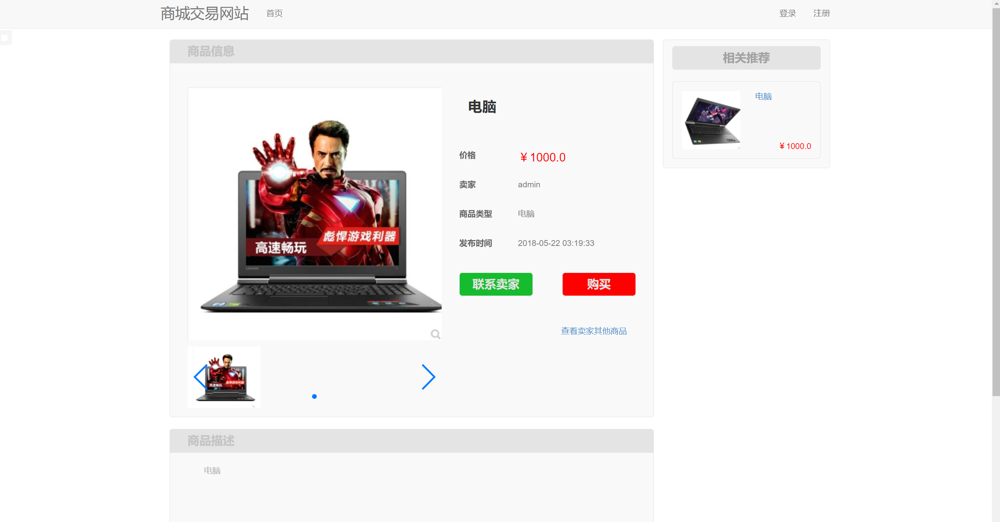
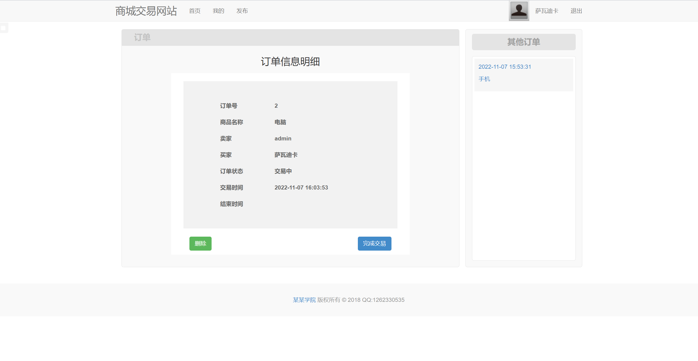
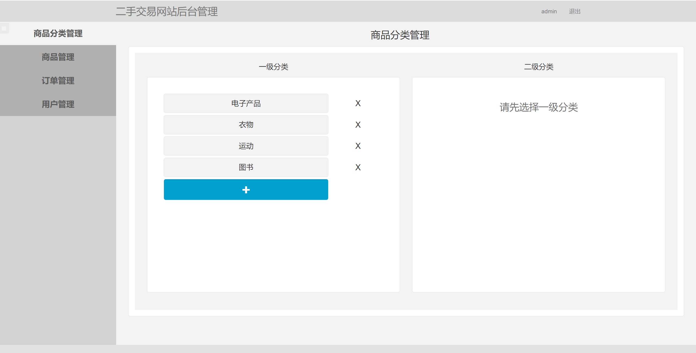
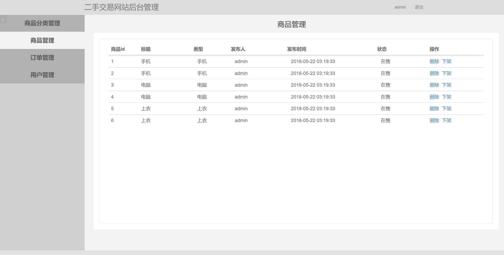
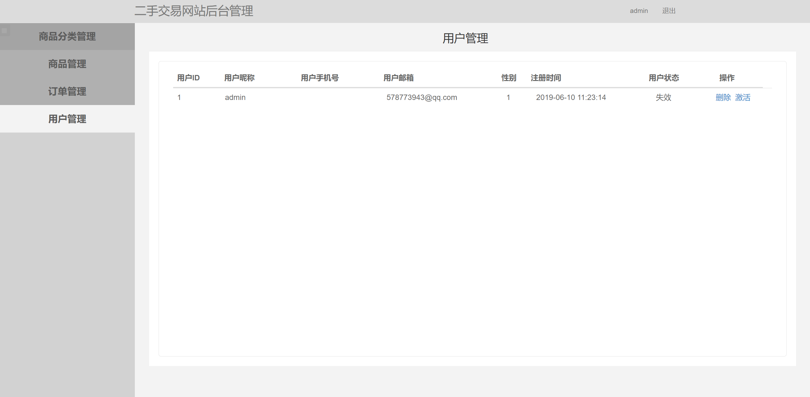

## 基于SSM框架的简单商城交易网站

###  获取sql数据库文件: 从戎源码网 (https://armycodes.com/) QQ: 386869957 QQ群: 377586148
###  所有系统地址: (https://github.com/YuLin-Coder/AllProjectCatalog) 
###  所有项目以及源代码本人均调试运行无问题 可支持远程安装部署调试、定制修改、代码讲解

## 项目介绍
基于SSM框架的简单商城交易网站，有用户和管理员两个角色，主要功能如下
1. 用户功能：
- 浏览各种商品：用户可以浏览商城中的各种商品，查看商品的详细信息、价格、库存等。
- 商品购买：用户可以将商品加入购物车，选择商品数量并进行结算，完成购买流程。
- 订单明细：用户可以查看自己的订单明细，包括已购买的商品列表、购买时间、订单状态等。

2. 管理员功能：
- 商品分类管理：管理员可以对商品进行分类管理，包括创建、编辑、删除商品分类，添加商品到相应分类等操作。
- 商品管理：管理员可以对商品进行管理，包括添加新商品、编辑商品信息、删除商品等操作。
- 订单管理：管理员可以查看所有订单列表，包括已完成的订单和待处理的订单，可以修改订单状态、取消订单等操作。
- 用户管理：管理员可以管理用户信息，包括查看用户列表、编辑用户信息、删除用户账号等操作。

## 项目技术
- 编程语言：Java
- 数据库：MySQL
- 前端技术：JSP、JavaScript、bootstrap、JQuery
- 后端技术：Spring、SpringMVC、MyBatis

## 运行环境
- JDK版本：JDK1.8及以上
- 开发工具：IDEA、Ecplise、Myecplise都可以
- 数据库: MySQL5.7及以上
- Maven：maven3.0及以上

## 运行截图

